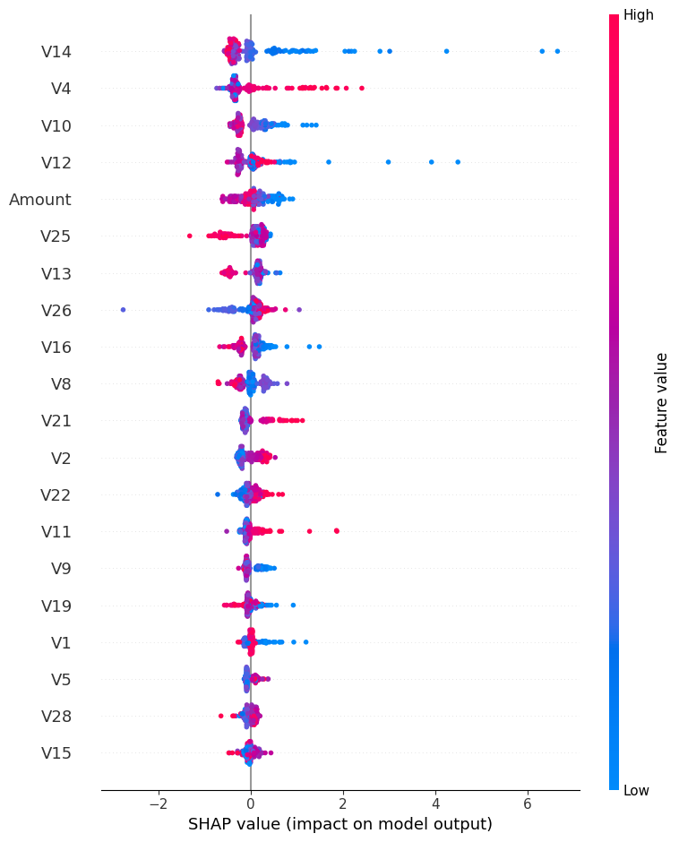

# 🛡️ Credit Card Fraud Detection with Machine Learning

This repository contains a machine learning pipeline for detecting fraudulent credit card transactions.  
The project demonstrates how to handle **imbalanced datasets**, tune thresholds for **high recall**, and explain model decisions using **SHAP values**.

---

## 📊 Project Overview
- **Dataset:** Publicly available credit card transactions dataset (2023 version).
- **Objective:** Detect fraudulent transactions with a focus on **capturing all fraud cases** (high recall), while keeping false alarms (false positives) at a reasonable level.
- **Model:** XGBoost with class imbalance handling.
- **Explainability:** SHAP values to interpret model predictions.

---

## 🚀 Features
- Data preprocessing (handling missing values, removing identifiers, feature scaling).
- Class imbalance adjustment with `scale_pos_weight`.
- Model training using **XGBoost**.
- Threshold tuning to prioritize **recall over precision**.
- Evaluation metrics:
  - Precision, Recall, F1-score
  - PR-AUC, ROC-AUC
  - Confusion Matrix
- Model explainability with **SHAP summary and waterfall plots**.

---

## 📈 Results
- **PR-AUC:** ~0.97  
- **Recall (Fraud detection):** 100%  
- **Precision:** ~0.89  
- **Confusion Matrix:**
```
[[TN, FP],
[FN, TP]]

[[4394, 2],
[ 0, 17]]
```
---

## 🔍 SHAP Explainability
SHAP (SHapley Additive exPlanations) helps us understand **which features drive fraud predictions**.



*Interpretation: Features on the top are most influential. Red indicates higher feature values, blue indicates lower values.*

---

## 🏗️ Project Structure
```
├── card_fraud_detection.ipynb # Google Colab notebook with full pipeline
├── images/
│ └── shap_summary.png # Example SHAP visualization
├── README.md # Project documentation
```
---

## 📌 Next Steps
- Add time-based validation for realistic fraud detection.
- Experiment with ensemble models (XGBoost + LightGBM + Random Forest).
- Deploy model as an API or batch inference service.
- Monitor drift and retrain with new data.

---

## 🙌 Acknowledgements
- Dataset: [Kaggle - Credit Card Fraud Detection (2023)](https://www.kaggle.com/)
- Libraries: `XGBoost`, `scikit-learn`, `SHAP`, `matplotlib`, `pandas`

---

Made with ❤️ by Esma
